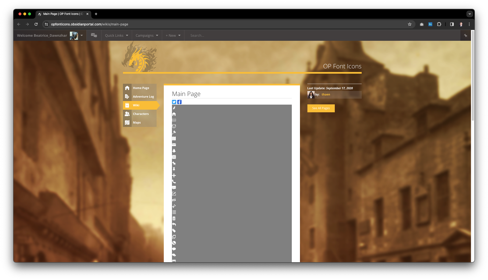
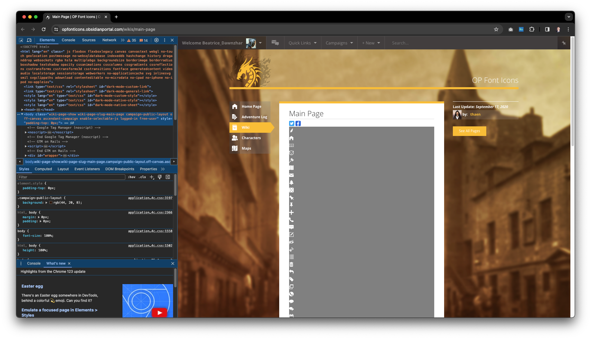
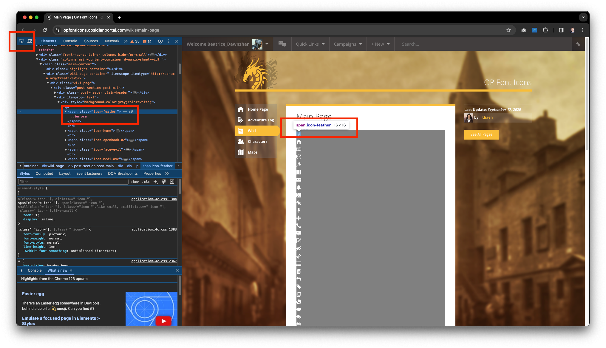

## Obsidian Portal custom navigation

See this Obsidian Portal docs article for more information:
https://help.obsidianportal.com/article/186-customizing-the-campaign-navigation

See this Obsidian Portal page for a list of all possible icons:
https://opfonticons.obsidianportal.com/wikis/main-page

The HTML snippet `obsidian-nav.html` is a custom navigation bar for the Shadow of the Seer
Obsidian Portal campaign. It adds navigation menu items for two pages that are not part of
the default Obsidian Portal navigation: the "Guilds" page and the "NPCs" page.

You can edit the icons Obsidian shows for the menu items by editing the
`obsidian-nav.html` to change the tags that begin like `icon-` or `op-icon-` to the name
of the icon you want to use. You can find the list of available icons at the page linked
at the top of this README.

When on the icons page, to find the name of the icon you want to use:

1. Open Chrome's Developer Tools (F12)
2. Click the "Elements" tab
3. Click the "Select an element in the page to inspect it" button (Ctrl+Shift+C on PC, or
   Cmd+Shift+C on Mac)
4. Click the icon you want to use
5. Look for the `class` attribute in the HTML element that represents the icon
6. The class name will be something like `op-icon-<icon-name>` or `icon-<icon-name>`
7. Copy the icon  class name and use it in the `obsidian-nav.html` file

### The icons page

### Chrome DevTools browsing the icons page

### Viewing the class name of an icon in Chrome DevTools

The names of the icons as of Sun Mar 24, 2024 were

1. `icon-feather`
2. `icon-home`
3. `icon-openbook-02`
4. `icon-face-evil`
5. `icon-medi-axe`
6. `icon-map`
7. `icon-mail-1`
8. `icon-bell`
9. `icon-dice-5`
10. `icon-pin-3`
11. `icon-pin-1`
12. `icon-plus`
13. `icon-phone-1`
14. `icon-speech-alt-2`
15. `icon-edit`
16. `icon-eye-4`
17. `icon-hourglass`
18. `icon-unordered-list`
19. `icon-kub-trash`
20. `icon-tl-undo`
21. `icon-tags`
22. `icon-restore`
23. `icon-phone-2`
24. `icon-speech-1`
25. `icon-conversation`
26. `icon-calendar-empty`
27. `icon-kub-search`
28. `icon-mapmarker4-blank`
29. `icon-card-hearts`
30. `icon-search`
31. `icon-lock-close`
32. `icon-cr2-help`
33. `icon-google__x2B_`
34. `icon-facebook`
35. `icon-twitter-3`
36. `icon-star`
37. `icon-cld-upload`
38. `icon-cld-download`
39. `icon-tl-editlink-dia`
40. `delete-link-icon`
41. `icon-file-txt`
42. `icon-file-pdf`
43. `icon-file-jpg`
44. `icon-file-png`
45. `icon-file-doc`
46. `icon-file-xml`
47. `icon-file1`
48. `icon-folder-close`
49. `icon-folders`
50. `icon-folder-open`
51. `op-icon-page`
52. `op-icon-messages`
53. `op-icon-map`
54. `op-icon-map-blank`
55. `op-icon-layers`
56. `op-icon-gm`
57. `op-icon-gears`
58. `op-icon-forum`
59. `op-icon-d20`
60. `op-icon-characters`
61. `op-icon-book`
62. `op-icon-book-wiki`
63. `op-icon-backpack`
64. `op-icon-alert`
65. `op-icon-player`
66. `op-icon-stats`
67. `op-icon-clock`
68. `op-icon-free`
69. `op-icon-wiki-link`
70. `op-icon-user-link`
71. `op-icon-media-link`
72. `op-icon-image-embed`
73. `op-icon-map-search`
74. `op-icon-dash`
75. `op-icon-dices`
76. `op-icon-js`
